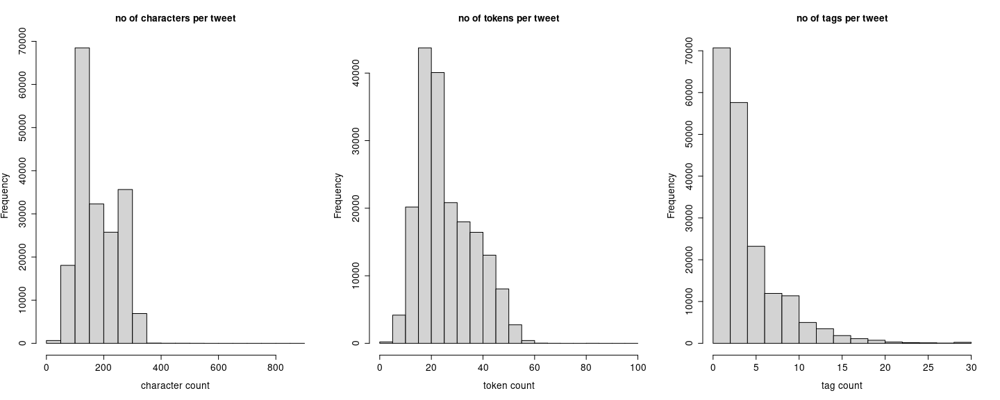
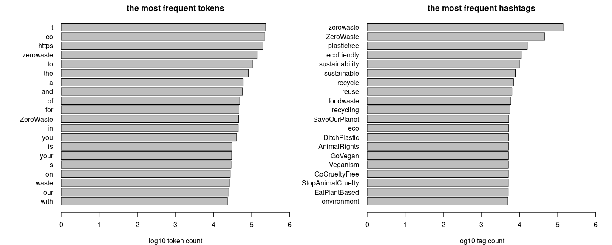
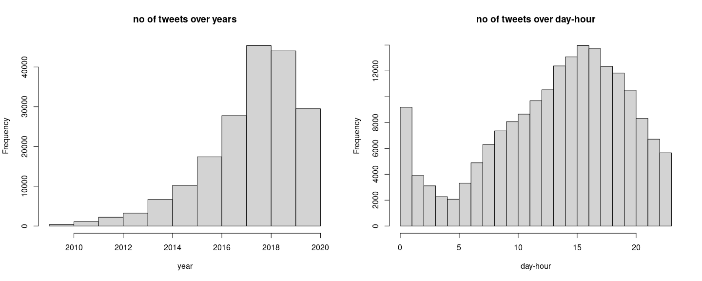
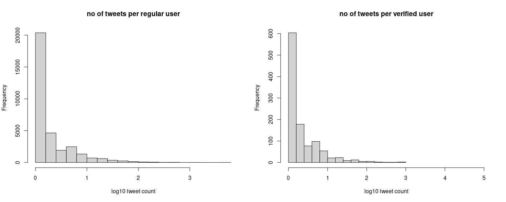
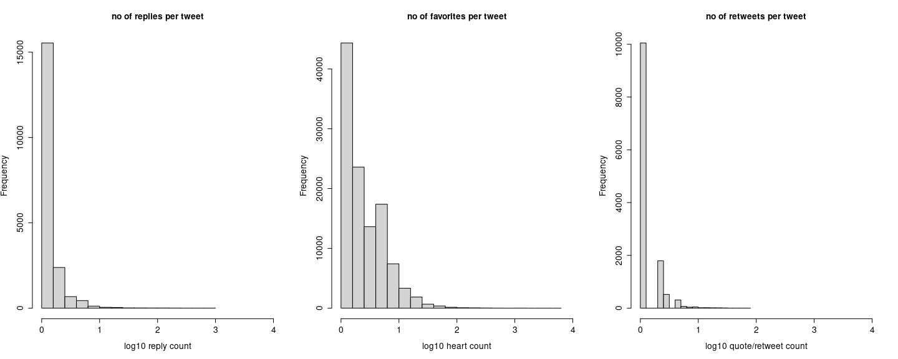
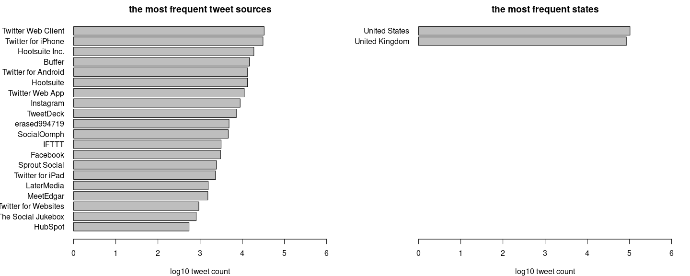

\#zerowaste subset - overall report
================

> Martin Fridrich 02/2021

This notebook aims to explore the pre-agreed subset of the \#zerowaste
tweets concerning the analysis’s original dimensions. We focus on the
distinct tweets written in English, with locations pinned down to the US
or UK. The document is structured as follows:

1 [Housekeepin’](#housekeepin)  
2 [Subsetting](#subsetting)  
3 [Exploratory data analysis](#exploratory-data-analysis)  
  3.1 [Computing characteristics](#computing-characteristics)  
  3.2 [Visualizations](#visualizations)  
4 [Next steps](#next-steps)

## Housekeepin’

In the opening section, we digest raw CSV files & union them into the
resulting `data.frame`. Moreover, we sanitize the column names and
present the overall structure of the dataset.

``` r
library(tidyverse)
data_dir = "..//..//data//zerowaste//"
csv_to_load = paste0(data_dir, list.files(data_dir, pattern=".csv"))
csv_ls = list()

for (fi in 1:length(csv_to_load)){
  csv_ls[[fi]] = data.table::fread(csv_to_load[fi],
    data.table=F, na.strings="", nThread=4)}

raw_tweets = data.table::rbindlist(csv_ls)
raw_tweets = raw_tweets %>% janitor::clean_names()
as_tibble(head(raw_tweets))
```

    ## # A tibble: 6 x 25
    ##        id name   screen_name user_id user_lang user_verified date     id_2 text 
    ##   <int64> <chr>  <chr>       <int64> <lgl>     <lgl>         <chr> <int64> <chr>
    ## 1 8.00e17 Clare… clarebeart… 2.00e 9 NA        FALSE         Sat … 8.00e17 RT @…
    ## 2 8.00e17 Alhy … alhykwood   2.00e 8 NA        FALSE         Sat … 8.00e17 RT @…
    ## 3 8.00e17 Ary I… ary_is_mail 2.00e 8 NA        FALSE         Sat … 8.00e17 Kesa…
    ## 4 8.00e17 Mayor… SFMONS      1.00e 8 NA        FALSE         Sat … 8.00e17 RT @…
    ## 5 8.00e17 Start… startupVon… 7.00e17 NA        FALSE         Sat … 8.00e17 RT @…
    ## 6 8.00e17 Fairw… FWPaddler   4.00e 9 NA        FALSE         Sat … 8.00e17 The …
    ## # … with 16 more variables: text_truncated <lgl>, lang <chr>, source <chr>,
    ## #   reply_count <int>, favorite_count <int>, quote_count <int>,
    ## #   user_location <chr>, derived_location <chr>, text_full <chr>,
    ## #   hashtags <chr>, in_retweet_to_id <int64>, in_retweet_to <chr>,
    ## #   in_retweet_to_user <chr>, in_quote_to_id <int64>, in_quote_to <chr>,
    ## #   in_quote_to_user <chr>

The data consists of 1119803 rows and 25 columns. It appears to be an
extended version of the export with more details regarding both the
tweets (interactions, language, links between the tweets, location,
device, etc.) & accounts (verification, language, location, etc.). The
columns appear to be loaded in the correct format except for the `Date`.
This allows us to incorporate much broader perspectives of the modeling.

``` r
raw_tweets$tweet = ifelse(raw_tweets$text_truncated,
  raw_tweets$text_full,raw_tweets$text)

# users
nu_users = length(unique(raw_tweets$user_id)) #on ids
nu_verified = length(unique(raw_tweets$user_id[raw_tweets$user_verified]))
# tweets
nid_tweets = length(unique(raw_tweets$id)) #on ids
nu_tweets = length(unique(raw_tweets$tweet)) #on texts
nid_retweets = sum(!is.na(raw_tweets$in_retweet_to_id))
nu_retweets = sum(grepl("RT @",raw_tweets$tweet))
```

We start with peeking at the fundamental characteristics of the full
dataset. We identify 328574 unique user accounts; only 5912 of them are
verified. We see 1119803 of unique tweets based on provided `id`,
although 733724 distinct tweets are based on the text itself. Similarly,
we observe 528218 retweets based on reference, but 733724 based on naive
RT detection. We see there is a slight disproportion in those metrics.

## Subsetting

In the next code chunks, we deal with the practical definition & forming
of the subset. Besides, we describe a few of its attributes

``` r
cleaned_datetime = strptime(gsub("\\+0000","",raw_tweets$date),
    format="%a %b %d %H:%M:%S %Y")
raw_tweets = arrange(raw_tweets, desc(cleaned_datetime))

# loc & lang filter
locs = sapply(raw_tweets$derived_location,
  function(x)ifelse(is.na(x),"NA", tail(strsplit(x,", ")[[1]],1)))
raw_tweets = raw_tweets[locs %in% c("United States","United Kingdom") & lang=="en",]

# duplicates
raw_tweets = distinct(raw_tweets, tweet, .keep_all=T)

# retweets
raw_tweets = raw_tweets[!grepl("RT @",raw_tweets$tweet),]
```

``` r
# users
nu_users = length(unique(raw_tweets$user_id)) #on ids
nu_verified = length(unique(raw_tweets$user_id[raw_tweets$user_verified]))
# tweets
nid_tweets = length(unique(raw_tweets$id)) #on ids
nu_tweets = length(unique(raw_tweets$tweet)) #on texts
nid_retweets = sum(!is.na(raw_tweets$in_retweet_to_id))
nu_retweets = sum(grepl("RT @",raw_tweets$tweet))
```

We start with checking the essential properties of the subset. The data
consists of 187888 rows and 26 columns. Furthermore, we see 34098 unique
user accounts; however, only 1092 verified. We observe 187888 of unique
tweets based on `id`, and 187888 distinct tweets are based on the text
itself. Similarly, we identify 0 retweets based on reference, and 0
based on naive RT detection. This is to be expected.

## Exploratory data analysis

### Computing characteristics

In the next code chunk, we construct base objects describing the
frequency distribution of the data concerning texts, tokens, covariates,
etc.

``` r
# texts
tweets = raw_tweets$tweet
n_chars = sapply(tweets, nchar)
names(n_chars) = NULL
n_tokens = stringr::str_count(tweets, "\\w+")
names(n_tokens) = NULL
n_tags = stringr::str_count(tweets, "#\\w+")
names(n_tags) = NULL

# top tokens
tokens = tweets %>%
  paste0(collapse = " ") %>%
  stringr::str_extract_all("\\w+") %>% unlist()
tab_tokens = table(tokens)

# top tags
tags = raw_tweets$hashtags %>%
  paste0(collapse = ",") %>% 
  strsplit(",") %>% unlist()
tab_tags = table(tags[nchar(tags)>0])

# languages
n_langs = table(raw_tweets$lang)

# datetime
cleaned_datetime = strptime(gsub("\\+0000","",raw_tweets$date),
    format="%a %b %d %H:%M:%S %Y")

# users
users = raw_tweets %>%
          group_by(user_id) %>%
          summarise(is_verified=max(user_verified),
                    n_tweets=n_distinct(text))
n_tweets = users$n_tweets

# devices
tab_devices = sapply(raw_tweets$source,
  function(x)ifelse(is.na(x),"NA", xml2::xml_text(xml2::read_html(x))))
tab_devices = table(tab_devices)

# locations
tab_locations = sapply(raw_tweets$derived_location,
  function(x)ifelse(is.na(x),"NA", tail(strsplit(x,", ")[[1]],1)))
tab_locations = table(tab_locations)
```

### Visualizations

Here, we visualize the probability density/distributions computed in the
preceding code chunk. Firstly, we peek at distributions describing the
properties of the tweet text & tags.

``` r
par(mfrow=c(1,3))
hist(n_chars,
     main="no of characters per tweet",
     xlab="character count",
     cex.main=1.3,
     cex.axis=1.3,
     cex.lab=1.3)
hist(n_tokens,
     main="no of tokens per tweet",
     xlab="token count",
     cex.main=1.3,
     cex.axis=1.3,
     cex.lab=1.3)
hist(n_tags,
     main="no of tags per tweet",
     xlab="tag count",
     cex.main=1.3,
     cex.axis=1.3,
     cex.lab=1.3)
```

<!-- -->

From the left plot, we can see that approx. half of the tweets are
shorter than 140 chars; however, some extended texts are almost 1000
char long. The middle plot shows that 75 % of the tweets consist of 29
words or less. Similarly, the right chart displays that 50 % of the
tweets employ less than four hashtags. There appears to be a slight
improvement of the token & tag count compared to the original set.

``` r
par(mfrow=c(1,2), mar=c(4,7.5,2,2))
barplot(rev(log10(sort(tab_tokens, decreasing=T)[1:20])),
        xlim=c(0,6),
        horiz = T, las=1,
        main="the most frequent tokens",
        xlab="log10 token count")
barplot(rev(log10(sort(tab_tags, decreasing=T)[1:20])),
        xlim=c(0,6),
        horiz = T, las=1,
        main="the most frequent hashtags",
        xlab="log10 tag count")
```

<!-- -->

In the first plot (left), one can see the most common word tokens.
Interestingly, the first three places are occupied by artifacts from web
addresses. In the first plot (left), we can see the 20 most popular
hashtags; most of the tags are relevant to the domain at hand. The local
diffusion suggested by the original tweets is not present.

``` r
round(sort(n_langs, decreasing=T)[1:10]/nrow(raw_tweets),3)*100
```

    ##   en <NA> <NA> <NA> <NA> <NA> <NA> <NA> <NA> <NA> 
    ##  100   NA   NA   NA   NA   NA   NA   NA   NA   NA

All selected texts are in English.

``` r
par(mfrow=c(1,2))
hist(lubridate::year(cleaned_datetime),
    main="no of tweets over years",
    xlab="year",
    breaks=11)
hist(lubridate::hour(cleaned_datetime),
    main="no of tweets over day-hour",
    xlab="day-hour",
    breaks=24)
```

<!-- -->

On the left, one observes a steady incline until 2019, a decline since.
On the right, we can see the frequency distribution of the data during
the day. The first peak (00) still breaks out from a somewhat smooth
distribution.

``` r
par(mfrow=c(1,2))
hist(log10(users$n_tweets[users$is_verified==0]),
     main="no of tweets per regular user",
     xlab="log10 tweet count")
hist(log10(users$n_tweets[users$is_verified==1]),
     main="no of tweets per verified user",
     xlab="log10 tweet count",
     xlim=c(0,5))
```

<!-- -->

The plots above suggest that an average number of tweets by regular or
verified users might be drawn from the same underlying probability
distribution.

``` r
par(mfrow=c(1,3))
hist(log10(raw_tweets$reply_count),
     main="no of replies per tweet",
     xlab="log10 reply count",
     xlim=c(0,4),
     cex.main=1.3,
     cex.axis=1.3,
     cex.lab=1.3)
hist(log10(raw_tweets$favorite_count),
     main="no of favorites per tweet",
     xlab="log10 heart count",
     xlim=c(0,4),
     cex.main=1.3,
     cex.axis=1.3,
     cex.lab=1.3)
hist(log10(raw_tweets$quote_count),
     main="no of retweets per tweet",
     xlab="log10 quote/retweet count",
     xlim=c(0,4),
     cex.main=1.3,
     cex.axis=1.3,
     cex.lab=1.3)
```

<!-- -->

The frequency distribution of user-interactions with the content are all
strongly right-skewed. We may consider including a total number of
interactions as a somewhat straightforward measure of relevance.

``` r
par(mfrow=c(1,2), mar=c(4,8,2,2))
barplot(rev(log10(sort(tab_devices, decreasing=T)[1:20])),
        xlim=c(0,6),
        horiz = T, las=1,
        main="the most frequent tweet sources",
        xlab="log10 tweet count")
barplot(rev(log10(sort(tab_locations, decreasing=T)[1:20])),
        xlim=c(0,6),
        horiz = T, las=1,
        main="the most frequent states",
        xlab="log10 tweet count")
```

<!-- -->

On the left, we see that even though most popular tweet sources are
organic, there is a considerable amount of marketing automation apps. On
the right, we see approximate locations of the tweets on a state level.

## Next steps

We eliminated most of the issues from the preliminary part of the
research with straightforward refinement. However, the resulting subset
needs to further analyzed concerning the textual content & topic models.

> Martin Fridrich 02/2021
