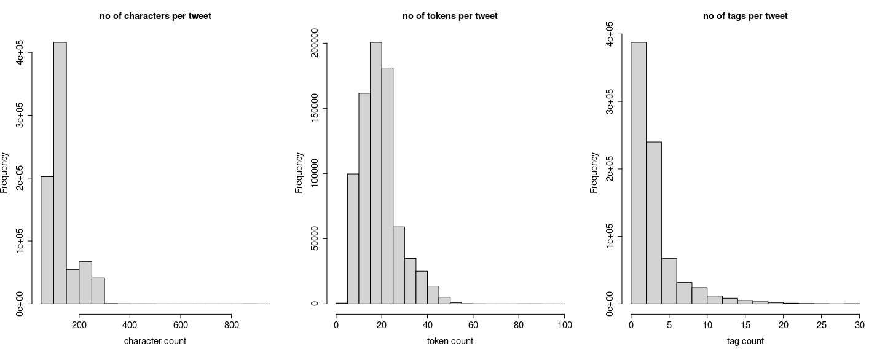
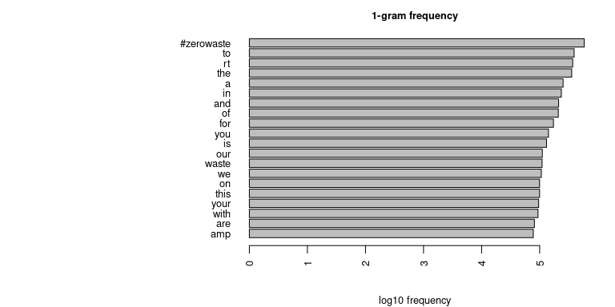
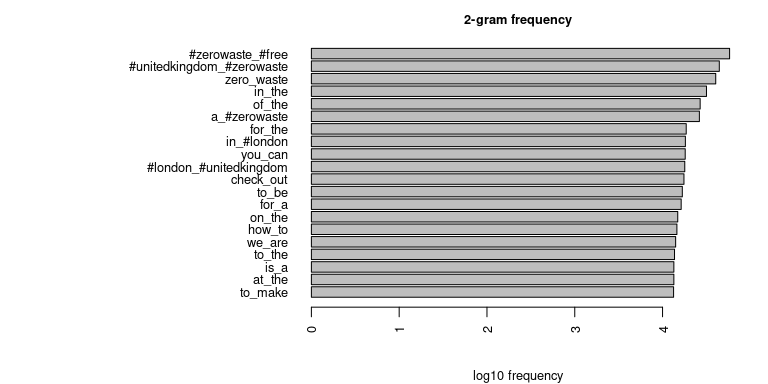
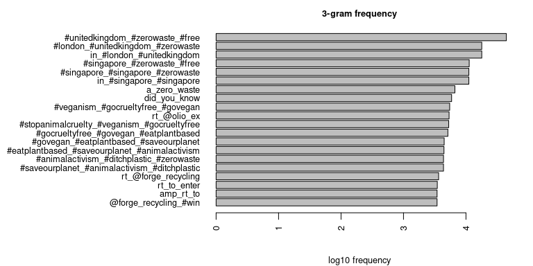
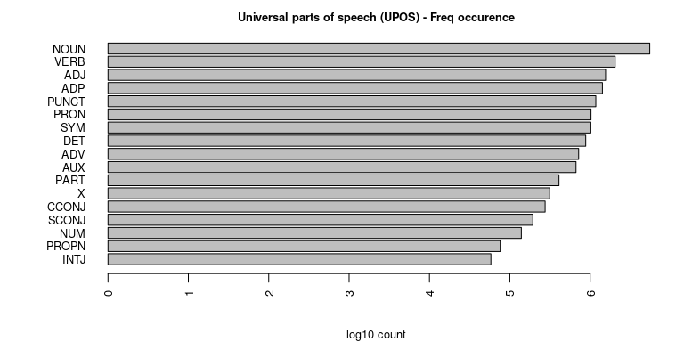
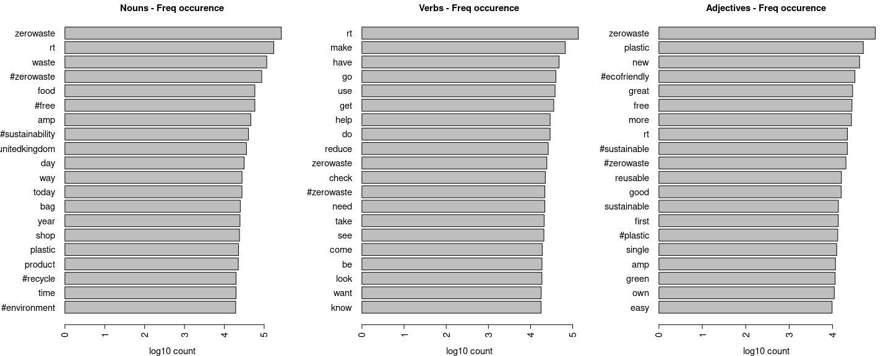
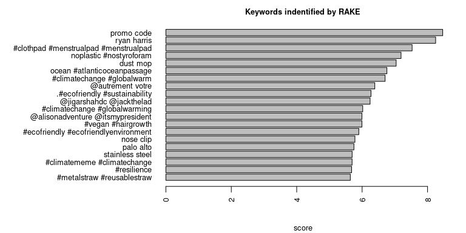
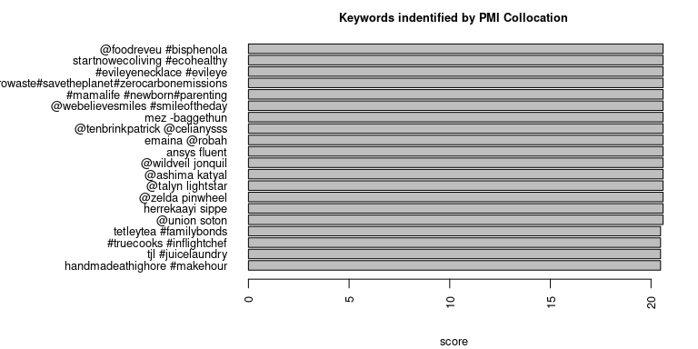
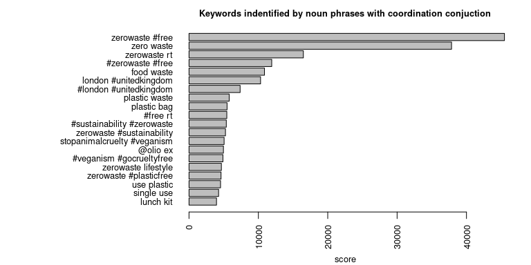
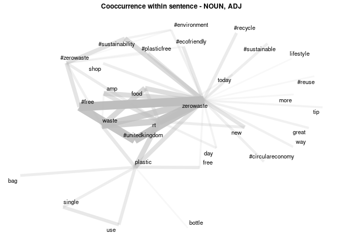

\#zerowaste tweets - textual report
================

> Martin Fridrich 02/2021

This document presents textual aspects of \#zerowaste tweets. Again, the
analysis will serve as a cornerstone of downstream processing & modeling
procedure. The paper is structured as follows:

1 [Housekeepin’](#housekeepin)  
2 [Data processing](#data-processing)  
  2.1 [Character-level](#character-level)  
  2.2 [Document-level](#document-level)  
  2.3 [Execution](#execution)  
3 [Exploratory data analysis](#exploratory-data-analysis)  
  3.1 [N-grams](#n-grams)  
  3.2 [Universal parts of speech](#universal-parts-of-speech)  
  3.3 [Keywords](#keywords)  
  3.4 [Co-occurrence](#co-occurrence)  
4 [Next steps](#next-steps)

## Housekeepin’

In the opening section, we digest raw CSV files & union them into the
resulting `data.frame`. Moreover, we sanitize the column names and
present the overall structure of the dataset.

``` r
library(tidyverse)
data_dir = "..//..//data//"
csv_to_load = paste0(data_dir, list.files(data_dir, pattern=".csv"))
csv_ls = list()

for (fi in 1:length(csv_to_load)){
  csv_ls[[fi]] = data.table::fread(csv_to_load[fi],
    data.table=F, na.strings="", nThread=4)}

raw_tweets = data.table::rbindlist(csv_ls)
raw_tweets = raw_tweets %>% janitor::clean_names()
as_tibble(head(raw_tweets))
```

    ## # A tibble: 6 x 25
    ##        id name  screen_name user_id user_lang user_verified date     id_2 text 
    ##   <int64> <chr> <chr>       <int64> <lgl>     <lgl>         <chr> <int64> <chr>
    ## 1 8.00e17 Clar… clarebeart… 2.00e 9 NA        FALSE         Sat … 8.00e17 RT @…
    ## 2 8.00e17 Alhy… alhykwood   2.00e 8 NA        FALSE         Sat … 8.00e17 RT @…
    ## 3 8.00e17 Ary … ary_is_mail 2.00e 8 NA        FALSE         Sat … 8.00e17 Kesa…
    ## 4 8.00e17 Mayo… SFMONS      1.00e 8 NA        FALSE         Sat … 8.00e17 RT @…
    ## 5 8.00e17 Star… startupVon… 7.00e17 NA        FALSE         Sat … 8.00e17 RT @…
    ## 6 8.00e17 Fair… FWPaddler   4.00e 9 NA        FALSE         Sat … 8.00e17 The …
    ## # … with 16 more variables: text_truncated <lgl>, lang <chr>, source <chr>,
    ## #   reply_count <int>, favorite_count <int>, quote_count <int>,
    ## #   user_location <chr>, derived_location <chr>, text_full <chr>,
    ## #   hashtags <chr>, in_retweet_to_id <int64>, in_retweet_to <chr>,
    ## #   in_retweet_to_user <chr>, in_quote_to_id <int64>, in_quote_to <chr>,
    ## #   in_quote_to_user <chr>

## Data processing

In this section, we propose and implement character & document level
transformation steps. Character level processing transforms the tweets
to lower case, removes XML tags, removes links, unusual characters, and
collapses multiple spaces. Document-level processing is also
conservative. We keep only tweets longer than 49 chars written in
English.

### Character-level

``` r
# char clean-up function
purge_chars = function(char_vec){
  # to lower
  char_vec = tolower(char_vec)
  # remove tags
  char_vec = gsub("<.*?>|</.*?>","",char_vec)
  # remove links
  char_vec = gsub("(s?)(f|ht)tp(s?)://\\S+\\b", "", char_vec)
  # use only a-z chars, spaces and punct
  char_vec = gsub("[^a-z#@ '.,?!\\-]"," ",char_vec)
  # collapse multiple spaces
  char_vec = gsub("\\s+"," ",char_vec)
  return(char_vec)}
```

### Document-level

``` r
# doc clean-up function
purge_docs = function(doc_df){
  doc_df = doc_df[nchar(doc_df$text)>=50,]
  doc_df = doc_df[doc_df$lang=="en",]
  # possibly add deduplication and/or other document filter
  return(doc_df)}
```

### Execution

The next code chunk applies the outlined transformation to the raw data.
Character level processing is done in a parallel manner.

``` r
library(parallel)
tweets = raw_tweets[,c("id","user_id", "text", "lang")]
tweets$text[raw_tweets$text_truncated] = raw_tweets$text_full[raw_tweets$text_truncated] 
cl = makeCluster(4)
  tweets$text = parSapply(cl, tweets$text, purge_chars)
stopCluster(cl)
tweets = purge_docs(tweets)
tweets$tid = 1:nrow(tweets)
```

## Exploratory data analysis

Within this section, we extract & examine selected properties of the
tweets considering the texts.

### Basic characteristics

``` r
n_tweets = nrow(tweets)
nu_tweets = length(unique(tweets$text))
nu_users = length(unique(tweets$user_id))
n_chars = nchar(tweets$text)
n_tokens = stringr::str_count(tweets$text, "\\w+")
n_tags = stringr::str_count(tweets$text, "#\\w+")
```

After the preprocessing step, we are left with 782174, where only 60 %
of which are unique. The data are generated by 214038 distinct user
accounts.

``` r
par(mfrow=c(1,3))
hist(n_chars,
     main="no of characters per tweet",
     xlab="character count",
     cex.main=1.4,
     cex.axis=1.4,
     cex.lab=1.4)
hist(n_tokens,
     main="no of tokens per tweet",
     xlab="token count",
     cex.main=1.4,
     cex.axis=1.4,
     cex.lab=1.4)
hist(n_tags,
     main="no of tags per tweet",
     xlab="tag count",
     cex.main=1.4,
     cex.axis=1.4,
     cex.lab=1.4)
```

<!-- -->

We can see that processed tweets are shorter than the original ones from
the left plot, with a median length \~ 130 chars. The tokens per tweet
seem to be right-skewed, with 75 % of tweets consisting of 23 or fewer
tokens. The right plot displays right-skewed tags per tweet
distribution; we see that 75 % of tweets utilize less than four
hashtags.

### N-grams

``` r
toks = quanteda::corpus(tweets, text_field="text", docid_field="tid") %>%
          quanteda::tokens(remove_numbers=T, remove_punct=T)

# plot grams func
plot_grams = function(toks, n){
  require(quanteda)
  grams = tokens_ngrams(toks, n=n)
  dfm_grams = dfm(grams)
  stat_grams = textstat_frequency(dfm_grams, n=20)
  stat_grams = stat_grams[order(stat_grams$frequency),]
  vec_grams = stat_grams$frequency
  names(vec_grams) = stat_grams$feature
  barplot(log10(vec_grams),
          las=2, horiz=T,
          main=paste0(n,"-gram frequency"),
          xlab="log10 frequency",
          cex.names=0.8, cex.lab=0.8,
          cex.main=0.8, cex=0.8)}
```

``` r
par(mar=c(4,16,2,2))
plot_grams(toks,1)
```

<!-- -->

``` r
plot_grams(toks,2)
```

<!-- -->

``` r
plot_grams(toks,3)
```

<!-- -->

In the first plot, we see that the most common uni-gram is the
`#zerowaste` token, followed by a couple of tokens related to common
sentence composition. The bi-gram plot shows a similar story; however,
we see the locality aspect represented by `#unitedkingdom_#zerowaste`,
or `#london_#unitedkingdom` popping out. The tri-gram plot demonstrates
the importance of Twitter entities such as retweet tokens, tags, or user
handles.

### Universal parts of speech

First of all, we attempt to load/download the `udpipe`’s `english-ewt`
model for text parsing (see the [performance
details](https://ufal.mff.cuni.cz/udpipe/1/models%5D)). Consequently, we
use the model to parse the tweets and annotate the tokens with relevant
metadata.

``` r
library(udpipe)

# try to reuse udpipe
udp_files = list.files("..//..//data//", pattern="udpipe$", full.names=TRUE)
if (length(udp_files)==0){
  udp_model = udpipe_download_model(language="english-ewt",
    model_dir="..//..//data//")
  upd_path = udp_model$file_model}else{
  file_df = file.info(udp_files)
  file_df = file_df[base::order(file_df$ctime,decreasing = T),]
  upd_path = rownames(file_df)[1]}
udp_model = udpipe_load_model(file = upd_path)
```

``` r
tweet_vec = tweets$text
names(tweet_vec) = tweets$tid
annotated_tweets = udpipe(tweet_vec, udp_model, parallel.cores=4)
annotated_tweets = as.data.frame(annotated_tweets, detailed=T)
annotated_tweets = annotated_tweets[,c("doc_id", "token_id", "sentence_id",
  "token", "lemma", "upos", "xpos", "dep_rel")]
head(annotated_tweets, 5) %>% as_tibble()
```

    ## # A tibble: 5 x 8
    ##   doc_id token_id sentence_id token           lemma          upos  xpos  dep_rel
    ##   <chr>  <chr>          <int> <chr>           <chr>          <chr> <chr> <chr>  
    ## 1 1      1                  1 rt              rt             VERB  VB    root   
    ## 2 1      2                  1 @goingzerowaste @goingzerowas… VERB  VB    ccomp  
    ## 3 1      3                  1 what            what           PRON  WP    obj    
    ## 4 1      4                  1 if              if             SCONJ IN    mark   
    ## 5 1      5                  1 you             you            PRON  PRP   nsubj

Let’s peek at observed frequency of various parts of speech.

``` r
par(mar=c(4,6,2,2))
barplot(log10(tail(sort(
  table(annotated_tweets$upos)),20)),
  las=2, horiz=T,
  cex.names=0.8, cex.lab=0.8,
  cex.main=0.8, cex=0.8,  
  main="Universal parts of speech (UPOS) - Freq occurence", 
  xlab="log10 count")
```



We see that the most common & exciting UPOS are `NOUN`, `VERB`, and
`ADJ`. The frequent tokens per each part of the speech type are depicted
below.

``` r
par(mfrow=c(1,3), mar=c(4,8,2,2))
barplot(log10(tail(sort(
  table(annotated_tweets$lemma[annotated_tweets$upos=="NOUN"])),20)),
  las=2, horiz=T,
  cex.names=1.4, cex.lab=1.4,
  cex.main=1.4, cex=1.4,    
  main="Nouns - Freq occurence", 
  xlab="log10 count")
barplot(log10(tail(sort(
  table(annotated_tweets$lemma[annotated_tweets$upos=="VERB"])),20)),
  las=2, horiz=T,
  cex.names=1.4, cex.lab=1.4,
  cex.main=1.4, cex=1.4,         
  main="Verbs - Freq occurence", 
  xlab="log10 count")
barplot(log10(tail(sort(
  table(annotated_tweets$lemma[annotated_tweets$upos=="ADJ"])),20)),
  las=2, horiz=T,
  cex.names=1.4, cex.lab=1.4,
  cex.main=1.4, cex=1.4,     
  main="Adjectives - Freq occurence", 
  xlab="log10 count")
```

<!-- -->

From bar plots above, one can observe creative use of tags across
depicted UPOS (i.e., within the sentence). Interestingly, `rt` token is
still prevalent. The results are aligned with our expectation. However,
some of the tags such as `amp` would need a bit more exploration.

### Keywords

Frequency stats in the previous section gives us some perspective of the
underlying text data. We will try to improve the insight with keyword
mining (i.e., extraction of a meaningful token pattern). We approach the
problem with RAKE (Rapid Automatic Keyword Extraction), collocation
using PMI (Pointwise Mutual Information), and noun phrases (see the
[docs](https://cran.r-project.org/web/packages/udpipe/udpipe.pdf) for
details).

``` r
rake_stats = keywords_rake(x=annotated_tweets, term="lemma",
  group=c("doc_id", "sentence_id"),
  relevant=annotated_tweets$upos %in% c("NOUN", "ADJ"),
  ngram_max=2, n_min=10)

pmi_stats = keywords_collocation(x=annotated_tweets, term="token",
  group=c("doc_id", "sentence_id"),
  ngram_max=2, n_min=10)

p = "((A(CA)*|N)*N((P(CP)*)+(D(CD)*)*(A(CA)*|N)*N)*(C(D(CD)*)*(A(CA)*|N)*N((P(CP)*)+(D(CD)*)*(A(CA)*|N)*N)*)*)"
snp_stats = keywords_phrases(x=as_phrasemachine(annotated_tweets$upos,
  type="upos"), term=annotated_tweets$lemma, pattern=p,
  ngram_max=2, is_regex=T, detailed=F)
snp_stats = snp_stats[snp_stats$ngram>1 & snp_stats$freq>=10, ]

# plot keys func
plot_keys = function(stats, col_name, descr=NA){
  require(dplyr)
  descr = paste0("Keywords indentified by ", coalesce(descr, toupper(col_name)))
  stats = arrange(stats, col_name)
  freqs = stats[1:20, col_name]
  names(freqs) = stats$keyword[1:20]
  barplot(rev(freqs),
    las=2, horiz=T,
    cex.names=0.8, cex.lab=0.8,
    cex.main=0.8, cex=0.8,
    main=descr, xlab="score")}
```

``` r
par(mar=c(4,14,2,2))
plot_keys(rake_stats,"rake")
```



The chart above correctly captures some of the key aspects of
\#zerowaste tweets such as `reusable #skipstraw` or
`animalactivism #ditchplastic`. Also replies/retweets to
`@tradomglobal @kashthefuturist` accounts appear. On the other hand, the
results illustrate the further need for careful text processing &
filtering (hyphens in `single -use` or `realitylink gt gt gt`).

``` r
par(mar=c(4,14,2,2))
plot_keys(pmi_stats,"pmi", "PMI Collocation")
```



PMI Collocation shows us mostly links between user accounts and obscure
tokens.

``` r
par(mar=c(4,14,2,2))
plot_keys(snp_stats,"freq", "noun phrases with coordination conjuction")
```



Noun phrases with coordination conjunction reveals exciting higher-level
latent factors of the \#zerowaste such as veganism/food -
`#gocrueltyfree #govegan`, `food waste`, shopping - `plastic bag`,
`grocery store`, and location - `london #unitedkingdom`. Again, some
other keywords illustrate need for further processing.

### Co-occurrence

In the next two chunks, we take a look at how the tokens are used
together. Once again, we retain only `NOUN` and `ADJ` parts of speech
and consider skipping up to 3 lemmas to form a co-occurrence pair.

``` r
cooc_stats = cooccurrence(annotated_tweets[annotated_tweets$upos %in%
    c("NOUN", "ADJ"), ], term="lemma", skipgram=3,
    group=c("doc_id", "sentence_id"))
head(cooc_stats,5) %>% as_tibble()
```

    ## # A tibble: 5 x 3
    ##   term1          term2           cooc
    ##   <chr>          <chr>          <dbl>
    ## 1 #free          zerowaste      45712
    ## 2 rt             zerowaste      40076
    ## 3 #free          #unitedkingdom 35947
    ## 4 #unitedkingdom zerowaste      35928
    ## 5 waste          zerowaste      25702

``` r
library(igraph)
library(ggraph)

cooc_net = cooc_stats[1:50,]
word_net = graph_from_data_frame(cooc_net)
set.seed(202002)
ggraph(word_net, 'kk') +
  geom_edge_link(aes(width=log10(cooc), edge_alpha=log10(cooc)), edge_colour='gray') +
  geom_node_text(aes(label=name), size=3, repel=T)+
  theme_graph(base_family="sans", background='white', title_size=10,
              title_margin=15, plot_margin = margin(5, 5, 5, 5))+
  theme(legend.position='none', plot.title = element_text(hjust = 0.5))+
  ggtitle('Cooccurrence within sentence - NOUN, ADJ')
```

<!-- -->

From the co-occurrence network above, one can see all tokens clustered
around the `zerowaste`. The triplet `zerowaste-#unitedkingdom-#free`
appears to be the most prominent. Another, a bit hidden, center is the
`rt`. Furthermore, there is an exciting component of the graph
describing disposable packaging (see the `plastic` and adjacent tokens).

## Next steps

**Character-level processing**

-   Remove/replace account handles.
-   …

**Document-level processing**

-   Address duplicates/retweets.
-   Address the issue of a relevance (What is a relevant tweet?).
-   …

**Token-level processing**

-   Filter on token length.
-   Filter on overall token frequency.
-   Focus on `NOUN`, `ADJ` & `VERB`. Additional stop-words?
-   Utilize lemmatized form of the tokens.
-   Explore & remove other strange, irrelevant tokens (`gt`, `amp`,
    `rt`).
-   …

**Others**

-   Correlation map for hashtags?
-   Computational complexity of the annotation step.
-   Topic modeling & other covariates.
-   …

> Martin Fridrich 02/2021
