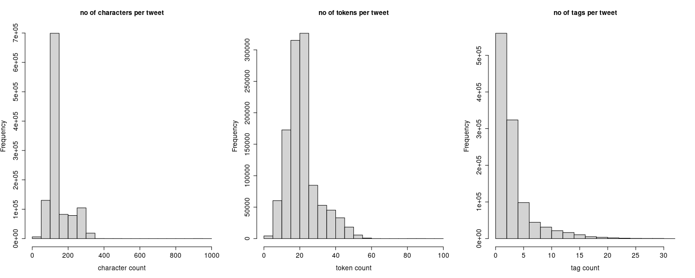
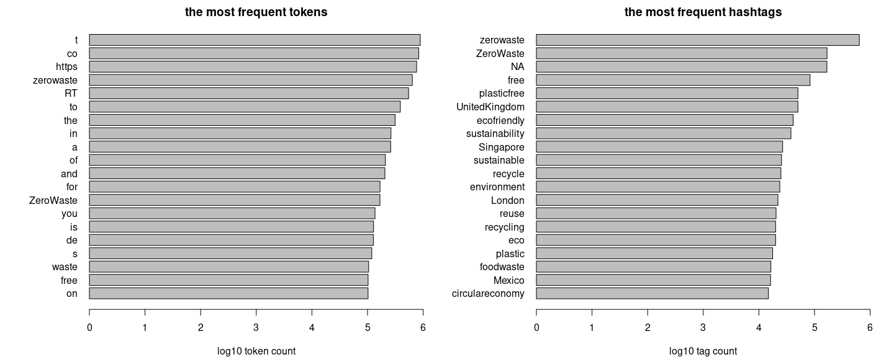
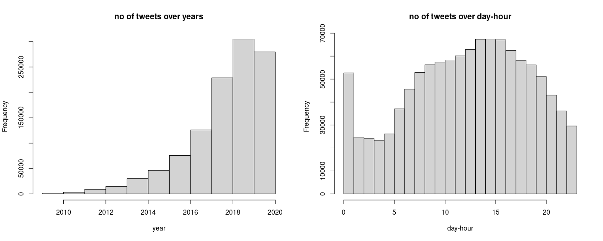
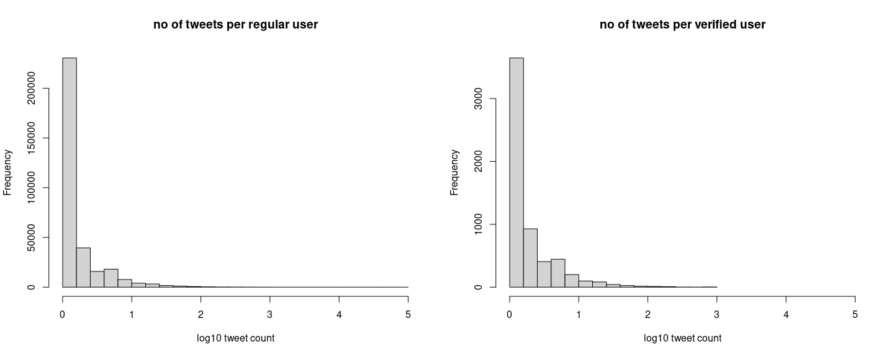
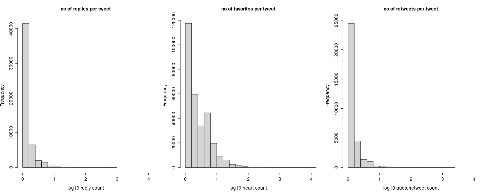
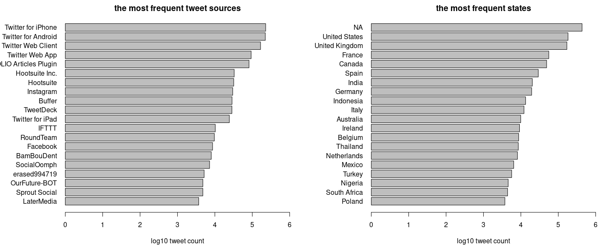

\#zerowaste tweets
================

> Martin Fridrich 01/2020

This notebook aims to explore the \#zerowaste data and provide a reader
with several insights. It will serve as a baseline for downstream
transformation & modeling procedures. The structure of the analysis is
as follows:

1 [Housekeepin’](#housekeepin)  
2 [Exploratory data analysis](#exploratory-data-analysis)  
  2.1 [Computing characteristics](#computing-characteristics)  
  2.2 [Visualizations](#visualizations)  
3 [Next steps](#next-steps)

## Housekeepin’

In the opening section, we digest raw CSV files & union them into the
resulting `data.frame`. Moreover, we sanitize the column names and
present the overall structure of the dataset.

``` r
library(tidyverse)
data_dir = "..//data//"
csv_to_load = paste0(data_dir, list.files(data_dir))
csv_ls = list()

for (fi in 1:length(csv_to_load)){
  csv_ls[[fi]] = data.table::fread(csv_to_load[fi],
    data.table=F, na.strings="", nThread=4)}

raw_tweets = data.table::rbindlist(csv_ls)
raw_tweets = raw_tweets %>% janitor::clean_names()
as_tibble(head(raw_tweets))
```

    ## # A tibble: 6 x 25
    ##        id name  screen_name user_id user_lang user_verified date     id_2 text 
    ##   <int64> <chr> <chr>       <int64> <lgl>     <lgl>         <chr> <int64> <chr>
    ## 1 8.00e17 Clar… clarebeart… 2.00e 9 NA        FALSE         Sat … 8.00e17 RT @…
    ## 2 8.00e17 Alhy… alhykwood   2.00e 8 NA        FALSE         Sat … 8.00e17 RT @…
    ## 3 8.00e17 Ary … ary_is_mail 2.00e 8 NA        FALSE         Sat … 8.00e17 Kesa…
    ## 4 8.00e17 Mayo… SFMONS      1.00e 8 NA        FALSE         Sat … 8.00e17 RT @…
    ## 5 8.00e17 Star… startupVon… 7.00e17 NA        FALSE         Sat … 8.00e17 RT @…
    ## 6 8.00e17 Fair… FWPaddler   4.00e 9 NA        FALSE         Sat … 8.00e17 The …
    ## # … with 16 more variables: text_truncated <lgl>, lang <chr>, source <chr>,
    ## #   reply_count <int>, favorite_count <int>, quote_count <int>,
    ## #   user_location <chr>, derived_location <chr>, text_full <chr>,
    ## #   hashtags <chr>, in_retweet_to_id <int64>, in_retweet_to <chr>,
    ## #   in_retweet_to_user <chr>, in_quote_to_id <int64>, in_quote_to <chr>,
    ## #   in_quote_to_user <chr>

The data consists of 1119803 rows and 25 columns. It appears to be an
extended version of the export with more details regarding both the
tweets (interactions, language, links between the tweets, location,
device, etc.) & accounts (verification, language, location, etc.). The
columns appear to be loaded in the correct format except for the `Date`.
This allows us to incorporate much broader perspectives of the modeling.

## Exploratory data analysis

Within this section, we extract & examine selected properties of the
tweets considering both texts and covariates.

``` r
# users
nu_users = length(unique(raw_tweets$user_id)) #on ids
nu_verified = length(unique(raw_tweets$user_id[raw_tweets$user_verified]))
# tweets
nid_tweets = length(unique(raw_tweets$id)) #on ids
nu_tweets = length(unique(raw_tweets$text)) #on texts
nid_retweets = sum(!is.na(raw_tweets$in_retweet_to_id))
nu_retweets = sum(grepl("RT @",raw_tweets$text))
```

We start with fundamental characteristics. However, we identify 328574
unique user accounts; only 5912 of them are verified. We see 1119803 of
unique tweets based on provided `id`, although 739036 distinct tweets
are based on the text itself. Similarly, we observe 528218 retweets
based on reference, but 739036 based on naive RT detection. We see there
is a slight disproportion in those metrics.

### Computing characteristics

In the next code chunk, we construct base objects describing the
frequency distribution of the data concerning texts, tokens, covariates,
etc.

``` r
# texts
tweets = ifelse(raw_tweets$text_truncated,
                raw_tweets$text_full,raw_tweets$text)
n_chars = sapply(tweets, nchar)
names(n_chars) = NULL
n_tokens = stringr::str_count(tweets, "\\w+")
names(n_tokens) = NULL
n_tags = stringr::str_count(tweets, "#\\w+")
names(n_tags) = NULL

# top tokens
tokens = tweets %>%
  paste0(collapse = " ") %>%
  stringr::str_extract_all("\\w+") %>% unlist()
tab_tokens = table(tokens)

# top tags
tags = raw_tweets$hashtags %>%
  paste0(collapse = ",") %>% 
  strsplit(",") %>% unlist()
tab_tags = table(tags[nchar(tags)>0])

# languages
n_langs = table(raw_tweets$lang)

# datetime
cleaned_datetime = strptime(gsub("\\+0000","",raw_tweets$date),
    format="%a %b %d %H:%M:%S %Y")

# users
users = raw_tweets %>%
          group_by(user_id) %>%
          summarise(is_verified=max(user_verified),
                    n_tweets=n_distinct(text))
n_tweets = users$n_tweets

# devices
tab_devices = sapply(raw_tweets$source,
  function(x)ifelse(is.na(x),"NA", xml2::xml_text(xml2::read_html(x))))
tab_devices = table(tab_devices)

# locations
tab_locations = sapply(raw_tweets$derived_location,
  function(x)ifelse(is.na(x),"NA", tail(strsplit(x,", ")[[1]],1)))
tab_locations = table(tab_locations)
```

### Visualizations

Here, we visualize the probability density/distributions computed in the
preceding code chunk. Firstly, we peek at distributions describing the
properties of the tweet text & tags.

``` r
par(mfrow=c(1,3))
hist(n_chars,
     main="no of characters per tweet",
     xlab="character count",
     cex.main=1.3,
     cex.axis=1.3,
     cex.lab=1.3)
hist(n_tokens,
     main="no of tokens per tweet",
     xlab="token count",
     cex.main=1.3,
     cex.axis=1.3,
     cex.lab=1.3)
hist(n_tags,
     main="no of tags per tweet",
     xlab="tag count",
     cex.main=1.3,
     cex.axis=1.3,
     cex.lab=1.3)
```

<!-- -->

From the left plot, we can see that approx. Half of the tweets are
shorter than 140 chars; however, some extended texts are almost 1000
char long. The middle shows that 75 % of the tweets consist of 25 words
or less. Similarly, the right plot displays that 75 % of the tweets
employ less than four hashtags. We recommend utilizing both texts &
tweets to achieve acceptable performance in downstream steps considering
the frequency distributions.

``` r
par(mfrow=c(1,2), mar=c(4,7.5,2,2))
barplot(rev(log10(sort(tab_tokens, decreasing=T)[1:20])),
        xlim=c(0,6),
        horiz = T, las=1,
        main="the most frequent tokens",
        xlab="log10 token count")
barplot(rev(log10(sort(tab_tags, decreasing=T)[1:20])),
        xlim=c(0,6),
        horiz = T, las=1,
        main="the most frequent hashtags",
        xlab="log10 tag count")
```

<!-- -->

In the first plot (left), we can see the 20 most popular hashtags; most
of the tags are relevant to the domain at hand. However, some of them,
such as `UnitedKingdom`, `Singapore` or `Mexico` suggest local
diffusion. In the second plot (right), one can see the most common word
tokens. Interestingly, the first three places are occupied by artifacts
from web addresses. It becomes evident that both tags & texts need
polishing.

``` r
round(sort(n_langs, decreasing=T)[1:10]/nrow(raw_tweets),3)*100
```

    ## 
    ##   en   fr   es  und   th   de   in   ca   it   tr 
    ## 71.0  6.5  5.7  3.4  2.9  2.4  2.2  1.1  0.8  0.8

Most of the observed texts are written in English. Thus, only half of
the data can be utilized as intended (i.e., tags + texts hybrid topic
model).

``` r
par(mfrow=c(1,2))
hist(lubridate::year(cleaned_datetime),
     main="no of tweets over years",
    xlab="year")
hist(lubridate::hour(cleaned_datetime),
     main="no of tweets over day-hour",
     xlab="day-hour",
     breaks=24)
```

<!-- -->

On the left, one observes a steady incline until 2019, a decline since.
On the right, we can see the frequency distribution of the data during
the day. The first peak (00) still breaks out from a somewhat smooth
distribution.

``` r
par(mfrow=c(1,2))
hist(log10(users$n_tweets[users$is_verified==0]),
     main="no of tweets per regular user",
     xlab="log10 tweet count")
hist(log10(users$n_tweets[users$is_verified==1]),
     main="no of tweets per verified user",
     xlab="log10 tweet count",
     xlim=c(0,5))
```

<!-- -->

The plots above suggest that an average number of tweets by regular or
verified users might be drawn from the same underlying probability
distribution.

``` r
par(mfrow=c(1,3))
hist(log10(raw_tweets$reply_count),
     main="no of replies per tweet",
     xlab="log10 reply count",
     xlim=c(0,4),
     cex.main=1.3,
     cex.axis=1.3,
     cex.lab=1.3)
hist(log10(raw_tweets$favorite_count),
     main="no of favorites per tweet",
     xlab="log10 heart count",
     xlim=c(0,4),
     cex.main=1.3,
     cex.axis=1.3,
     cex.lab=1.3)
hist(log10(raw_tweets$quote_count),
     main="no of retweets per tweet",
     xlab="log10 quote/retweet count",
     xlim=c(0,4),
     cex.main=1.3,
     cex.axis=1.3,
     cex.lab=1.3)
```

<!-- -->

The frequency distribution of user-interactions with the content are all
strongly right-skewed. We consider including a total number of
interactions as a somewhat straightforward measure of relevance.

``` r
par(mfrow=c(1,2), mar=c(4,8,2,2))
barplot(rev(log10(sort(tab_devices, decreasing=T)[1:20])),
        xlim=c(0,6),
        horiz = T, las=1,
        main="the most frequent tweet sources",
        xlab="log10 tweet count")
barplot(rev(log10(sort(tab_locations, decreasing=T)[1:20])),
        xlim=c(0,6),
        horiz = T, las=1,
        main="the most frequent states",
        xlab="log10 tweet count")
```

<!-- -->

On the left, we see that even though most popular tweet sources are
organic, there is a considerable amount of marketing automation apps. On
the right, we see approximate locations of the tweets on a state level.
Both perspectives might help us in further efforts concerning the
relevancy of the analysis’s tweets & scope.

``` r
# data integrity
missing_retweets = 1-sum(raw_tweets$in_retweet_to_id %in% raw_tweets$id)/
  sum(!is.na(raw_tweets$in_retweet_to_id))
missing_quotes = 1-sum(raw_tweets$in_quote_to_id %in% raw_tweets$id)/
  sum(!is.na(raw_tweets$in_quote_to_id))
```

Lastly, we check on data-integrity of the export in terms on the
retweets & quotes. We see that out of 528218 retweets, there is 0.3 % of
them missing. Similarly, out of 71372 quotes, 83.05 % of them are
missing.

## Next steps

**General**

-   Re-iterate on the project scope & timeline.
-   Re-iterate on the prior hypothesis.
-   Discuss what is a relevant tweet.

**Dataset**

We would like to have detailed info regarding the data generation
process. Some of the issues from the first dataset still prevail.
However, addressing the problems have to be align with the project scope
(e.g. page-ranking users might not make any sense with the dataset at
hand, etc.).

**Preprocessing**

Filtering based on account entities & different parameters for selection
should be examined. This is necessary in order to eliminate irrelevant
observations & features. Moreover, we propose to employ hybrid model
based on texts, tags & covariates. Thus, respective processing pipelines
have to be designed and developed.

> Martin Fridrich 01/2020
