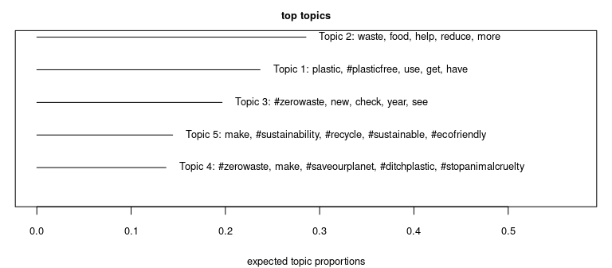
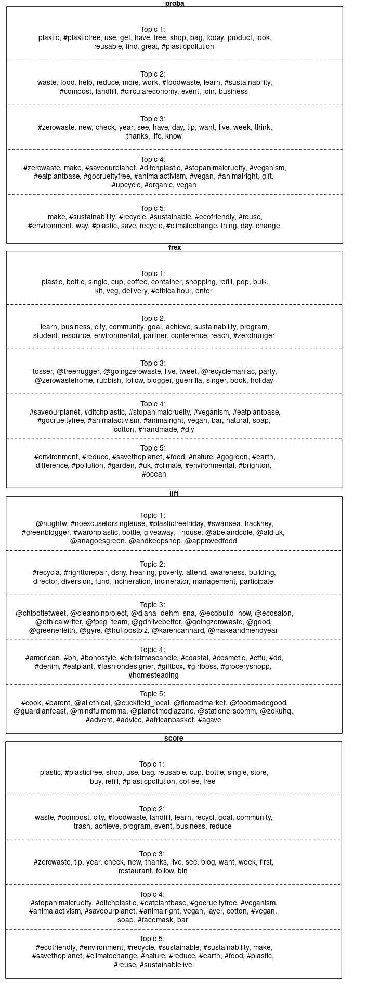
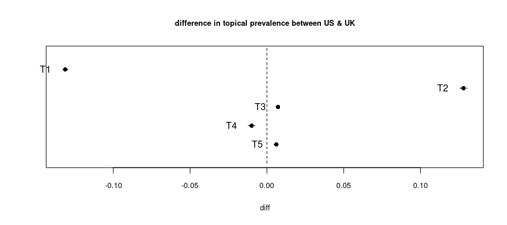
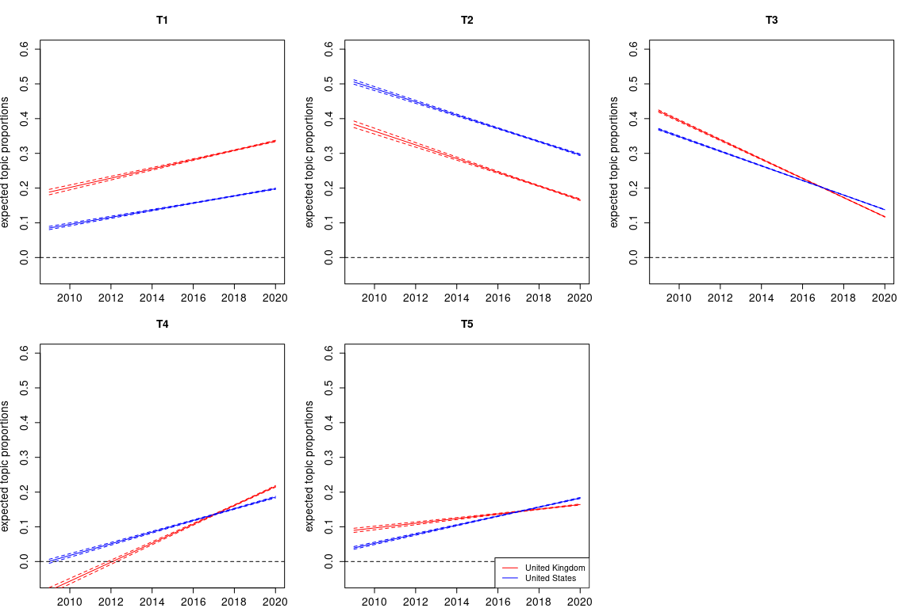
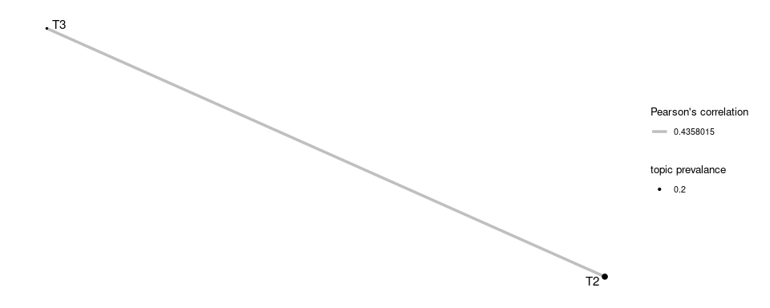

> Martin Fridrich 06/2021

This work draws insights into #zerowaste data using the structural topic model with five latent factors. Please note that the preliminary transformations, exploratory data analysis, and hyperopt are part of the [previous analysis](modeling-report.md). The current document is structured as follows:

1 [Summary]  
2 [Topic labels]  
3 [Covariates]  
4 [Correlation map]  

## Summary

The print-out below shows that 5-topic stm is built on top of 155,478 docs and the 12,385 token corpora. The solution demonstrated a *semcoh* of ~ -126.4 and *frex* of ~9.1; compared with other models, it showed the highest *semcoh* and the lowest *frex*, i.e., the model prefers the co-occurrence of the most probable tokens within the topic over the exclusivity of topical tokens.

```{r}
print(readLines("../../data/model-perspective/05-topics/_summary.txt"))
```

## Topic labels

To outline the contents of the latent factors, we aid the human reader with three perspectives: (1) prevalence, (2) frequent & exclusive tokens, and (3) representative documents.

The overall topical prevalence is outlined in the plot below. Please note that descriptive tokens are selected using *proba*. The *T2* appears to be the most prevalent topic, hitting almost ~ 30 % of all tweets, *T4* is the least popular one with a slightly over 10 % prevalence. 



To further understand the prevalent topics, we employ four different metrics for representative token rankings, namely *proba*, *frex*, *lift*, and *score*. The results are presented in the figure below.



Let's analyze the *T1*. The *proba* perspective follows tokens related to shopping (shop, bag, product, look) and plastics (plastic, #plasticfree, reusable, #plasticpollution). The *frex* perspective shows the importance of drinkware (bottle, cup, coffee, container, refill). The *lift* reveals mainly Twitter account handles. The *score* appears to be the mix of the first two.

In addition, latent factors can be examined from the perspective of the most representative documents. For each topic, we extract only tweets with a prevalence of 50 % or higher. For each tweet, riginal raw text is printed. Now, let's take a look at the *T1's*  representative tweets.

```{r}
read.csv("../../data/model-perspective/05-topics/representative-tweets.csv")[1:3,4]
```
Interestingly, we see that all tweets are related to the marketing campaigns, ranging from the degradable tea bags, over the "bring in own containers", to the reusable wrappings. We believe that an insufficient number of topics causes the variety; however, this factor still seems related to packaging.

## Covariates

Here, we take a look at the relationships between the topics and external covariates. We are interested in the discrepancies between the countries and changes in prevalence over time.


The chart above shows the expected difference between factor prevalence in the US & UK. There are outlying cluster topics popular in the UK on the upper left corner of the plot (T1). We can see the subject as more relevant for the US (T2).

We are interested in changes in topic proportions over time to reflect that we assume a linear relationship between the variables such as `prevalence ~ year + state + state*year`; interaction allows for unparalleled line fits.



In the plot above, we outline overall topical trends across the countries. We see that *T1*, *T4*, and *T5* are rising; *T2*, *T3* on the decline. The most apparent difference between the US & UK is shown in intercepts of *T1*, and *T2*; this observation is in line with our previous findings. *T4*, *T5* come to light in the second half of the examined period.

## Correlation map

The topic model allows for correlation between topics; positive correlation suggests that both subjects are likely to be discussed within one tweet. We construct a network with positive correlations between factors, where asymptotic p-value < 0.05.



As a result, we can show one graph components of correlated topics *T2* and *T3*, despite observed differences in the country dimension.