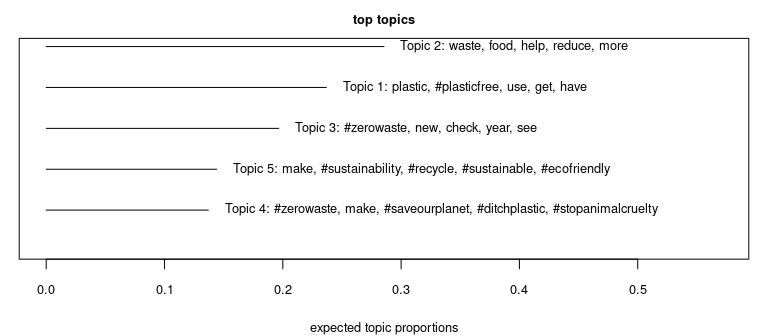
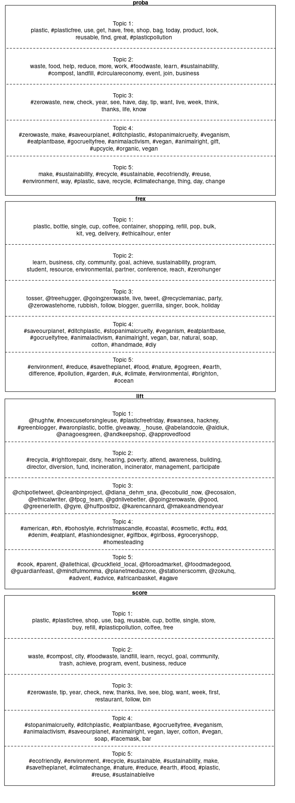
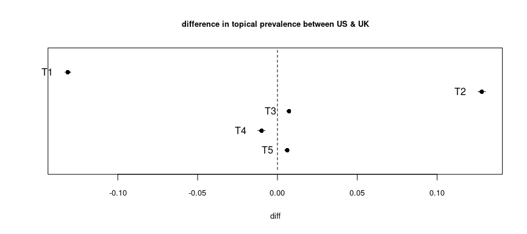
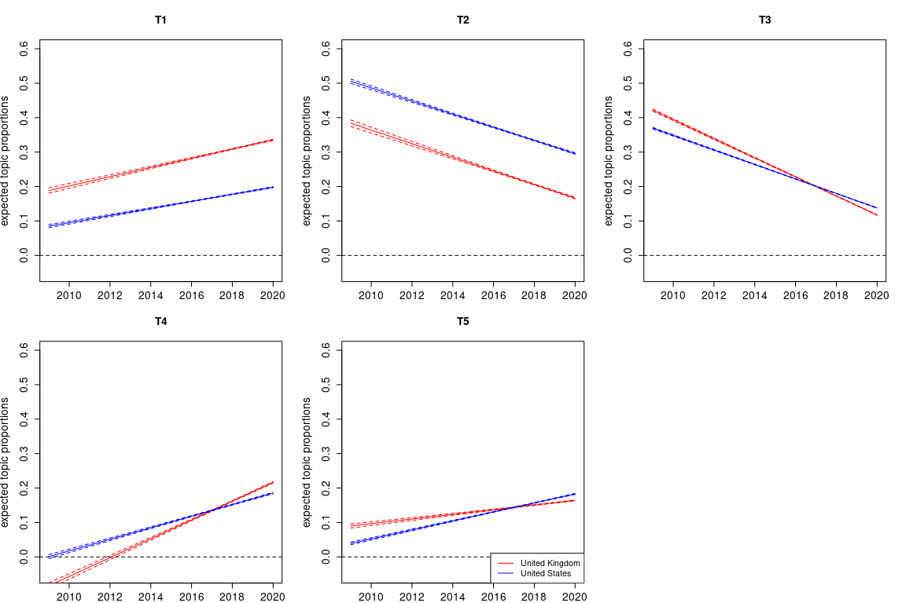
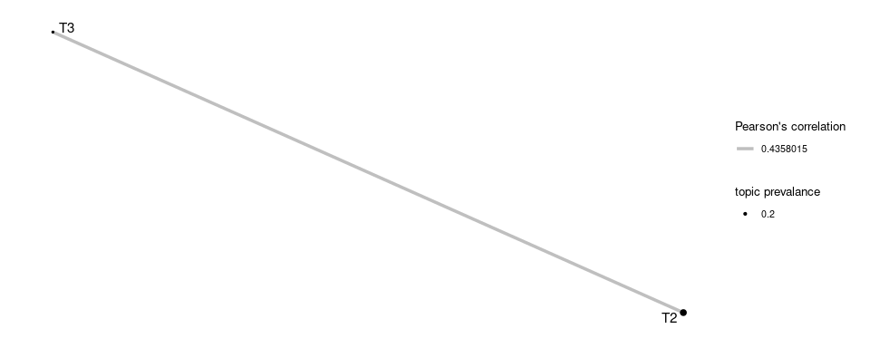

Insights into \#zerowaste data with 5-topic stm
================

> Martin Fridrich 06/2021

This work draws insights into \#zerowaste data using the structural
topic model with five latent factors. Please note that the preliminary
transformations, exploratory data analysis, and hyperopt are part of the
[previous analysis](modeling-report.md). The current document is
structured as follows:

1 [Summary](#summary)  
2 [Topic labels](#topic-labels)  
3 [Covariates](#covariates)  
4 [Correlation map](#correlation-map)

## Summary

The print-out below shows that 5-topic stm is built on top of 155,478
docs and the 12,385 token corpora. The solution demonstrated a *semcoh*
of \~ -126.4 and *frex* of \~9.1; compared with other models, it showed
the highest *semcoh* and the lowest *frex*, i.e., the model prefers the
co-occurrence of the most probable tokens within the topic over the
exclusivity of topical tokens.

``` r
print(readLines("../../data/model-perspective/05-topics/_summary.txt"))
```

    ## [1] "We fit a topic model with 5 topics, 155478 documents and a 12385 word dictionary."           
    ## [2] "In addition, the model's semantic coherence is -126.424891 and its exclusivity is 9.060011. "

## Topic labels

To outline the contents of the latent factors, we aid the human reader
with three perspectives: (1) prevalence, (2) frequent & exclusive
tokens, and (3) representative documents.

The overall topical prevalence is outlined in the plot below. Please
note that descriptive tokens are selected using *proba*. The *T2*
appears to be the most prevalent topic, hitting almost \~ 30 % of all
tweets, *T4* is the least popular one with a slightly over 10 %
prevalence.



To further understand the prevalent topics, we employ four different
metrics for representative token rankings, namely *proba*, *frex*,
*lift*, and *score*. The results are presented in the figure below.



Let’s analyze the *T1*. The *proba* perspective follows tokens related
to shopping (shop, bag, product, look) and plastics (plastic,
\#plasticfree, reusable, \#plasticpollution). The *frex* perspective
shows the importance of drinkware (bottle, cup, coffee, container,
refill). The *lift* reveals mainly Twitter account handles. The *score*
appears to be the mix of the first two.

In addition, latent factors can be examined from the perspective of the
most representative documents. For each topic, we extract only tweets
with a prevalence of 50 % or higher. For each tweet, riginal raw text is
printed. Now, let’s take a look at the *T1’s* representative tweets.

``` r
read.csv("../../data/model-perspective/05-topics/representative-tweets.csv")[1:3,4]
```

    ## [1] "Fill Yer Boots &amp; Brew Yer Tea!This loose tea is so pretty! We love our tea infusers but sometimes we like the convenience of a bag too, and ours are plastic-free and degradable, no microplastics!Fill Yer Boots &amp; Brew Yer Tea!#plasticfree #zerowaste #looseleaftea #tea #brew https://t.co/LgWcWZefTD"   
    ## [2] "Delighted to have our loose-serve #frozen fruit &amp; veg stocked in #ZeroWaste Shop @PedricksZero .Customers simply bring their own containers to purchase!They have a fab selection of local produce sourced from local suppliers &amp; is available plastic free. https://t.co/sRq4rNwacg https://t.co/32SKohNuou"
    ## [3] "**Giveaway** It's time to ditch single use disposable wrapping paper. Find out more about the alternatives and enter to win @wragwrap and @keepthiscracker prizeshttps://t.co/YB6pLGn4Oo#zerowaste #competition #CutTheWrap"

Interestingly, we see that all tweets are related to the marketing
campaigns, ranging from the degradable tea bags, over the “bring in own
containers”, to the reusable wrappings. We believe that an insufficient
number of topics causes the variety; however, this factor still seems
related to packaging.

## Covariates

Here, we take a look at the relationships between the topics and
external covariates. We are interested in the discrepancies between the
countries and changes in prevalence over time.

 The
chart above shows the expected difference between factor prevalence in
the US & UK. There are outlying cluster topics popular in the UK on the
upper left corner of the plot (T1). We can see the subject as more
relevant for the US (T2).

We are interested in changes in topic proportions over time to reflect
that we assume a linear relationship between the variables such as
`prevalence ~ year + state + state*year`; interaction allows for
unparalleled line fits.



In the plot above, we outline overall topical trends across the
countries. We see that *T1*, *T4*, and *T5* are rising; *T2*, *T3* on
the decline. The most apparent difference between the US & UK is shown
in intercepts of *T1*, and *T2*; this observation is in line with our
previous findings. *T4*, *T5* come to light in the second half of the
examined period.

## Correlation map

The topic model allows for correlation between topics; positive
correlation suggests that both subjects are likely to be discussed
within one tweet. We construct a network with positive correlations
between factors, where asymptotic p-value &lt; 0.05.



As a result, we can show one graph components of correlated topics *T2*
and *T3*, despite observed differences in the country dimension.
