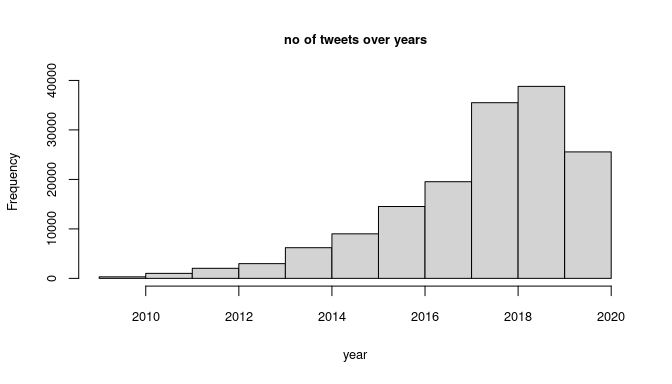
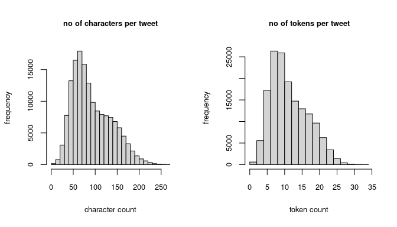
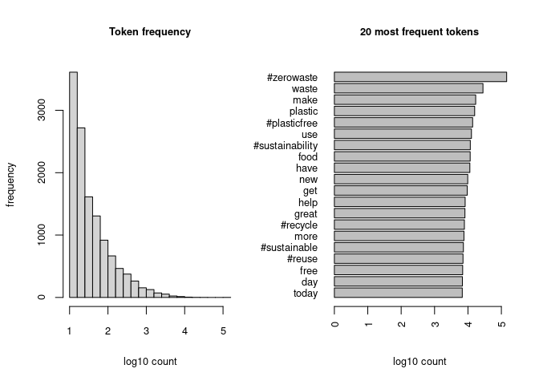
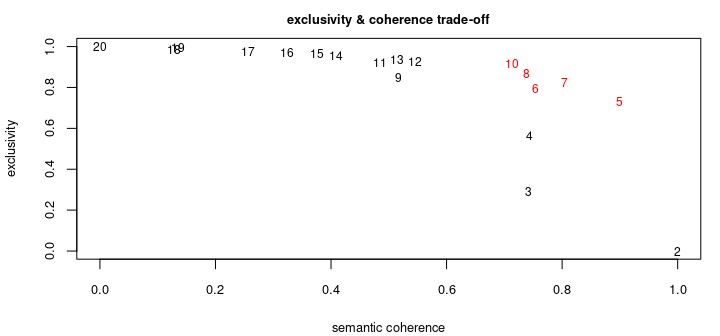
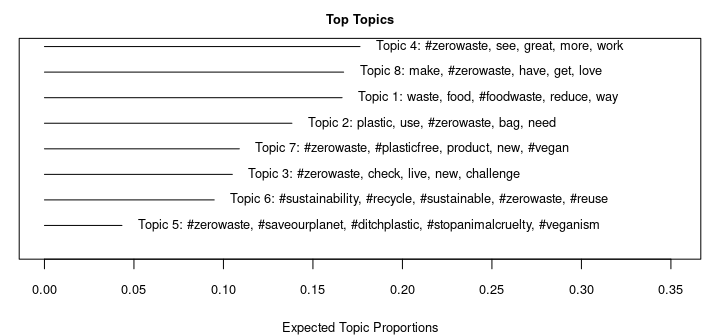
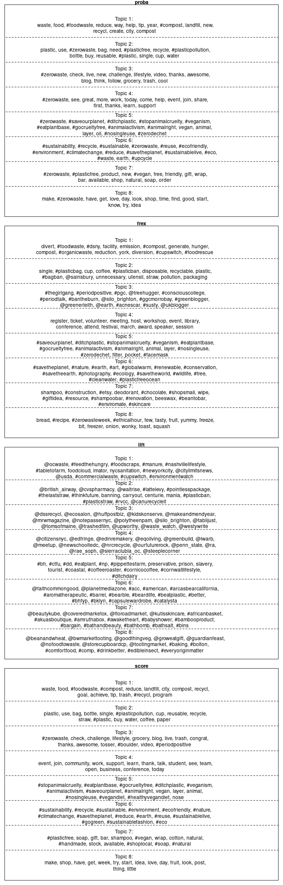
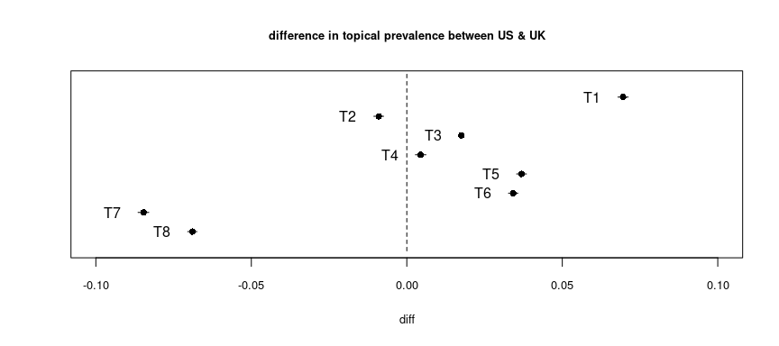
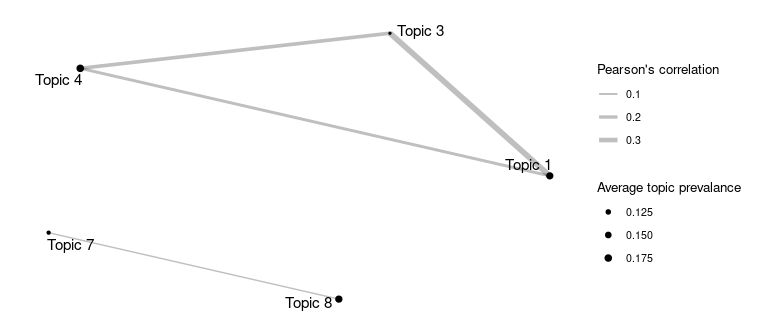

\#zerowaste subset - topic modeling report
================

> Martin Fridrich 03/2021

This document aims to preprocess the \#zerowaste tweets, examine
properties of the resulting dataset, find a viable topic model, and
present imprinted perspectives. The study is structured as follows:

1 [Housekeepin’](#housekeepin)  
2 [Data processing](#data-processing)  
  2.1 [Covariate, character & document-level
processing](#covariate-character-document-level-processing)  
  2.2 [Token-level processing](#token-level-processing)  
  2.3 [Execution](#execution)  
3 [Exploratory data analysis](#exploratory-data-analysis)  
4 [Topic modeling](#topic-modeling)  
  4.1 [Hyperparameter sweep](#hyperparameter-sweep)  
  4.2 [Topic labels](#topic-labels)  
  4.3 [Covariates](#covariates)  
  4.4 [Correlation map](#correlation-map)  
5 [Next steps](#next-steps)

## Housekeepin’

In the opening section, we load required libs, import raw CSV files &
union them into the resulting data.frame. In addition, we sanitize the
column names and present the overall structure of the dataset.

``` r
data_dir = "..//..//data//"
csv_to_load = paste0(data_dir, list.files(data_dir, pattern=".csv"))
csv_ls = list()

for (fi in 1:length(csv_to_load)){
  csv_ls[[fi]] = data.table::fread(csv_to_load[fi],
    data.table=F, na.strings="", nThread=4)}

raw_tweets = data.table::rbindlist(csv_ls)
raw_tweets = raw_tweets %>% janitor::clean_names() %>% as.data.frame()
as_tibble(head(raw_tweets))
```

    ## # A tibble: 6 x 25
    ##        id name   screen_name user_id user_lang user_verified date     id_2 text 
    ##   <int64> <chr>  <chr>       <int64> <lgl>     <lgl>         <chr> <int64> <chr>
    ## 1 8.00e17 Clare… clarebeart… 2.00e 9 NA        FALSE         Sat … 8.00e17 RT @…
    ## 2 8.00e17 Alhy … alhykwood   2.00e 8 NA        FALSE         Sat … 8.00e17 RT @…
    ## 3 8.00e17 Ary I… ary_is_mail 2.00e 8 NA        FALSE         Sat … 8.00e17 Kesa…
    ## 4 8.00e17 Mayor… SFMONS      1.00e 8 NA        FALSE         Sat … 8.00e17 RT @…
    ## 5 8.00e17 Start… startupVon… 7.00e17 NA        FALSE         Sat … 8.00e17 RT @…
    ## 6 8.00e17 Fairw… FWPaddler   4.00e 9 NA        FALSE         Sat … 8.00e17 The …
    ## # … with 16 more variables: text_truncated <lgl>, lang <chr>, source <chr>,
    ## #   reply_count <int>, favorite_count <int>, quote_count <int>,
    ## #   user_location <chr>, derived_location <chr>, text_full <chr>,
    ## #   hashtags <chr>, in_retweet_to_id <int64>, in_retweet_to <chr>,
    ## #   in_retweet_to_user <chr>, in_quote_to_id <int64>, in_quote_to <chr>,
    ## #   in_quote_to_user <chr>

## Data processing

In this section, we outline and implement covariate, character, document
& token level transformation steps. Covariates transformation include
datetime conversion & state extraction. Character level processing
transforms the tweets to lower case, removes XML tags, removes links,
unusual characters, and collapses multiple spaces. Document-level
processing is conservative; we keep only tweets written in English and
originated in the US/UK. Consequently, we annotate the tokens with
`udpipe` and retain only `VERB`, `ADJ` & `NOUN` observed in at least ten
separate tweets.

### Covariate, character & document-level processing

``` r
# covariate-level
purge_covs = function(doc_df){
  # form date cov
  doc_df$date = strptime(gsub("\\+0000","",doc_df$date), format="%a %b %d %H:%M:%S %Y")
  doc_df$year = lubridate::year(doc_df$date)
  # form state cov
  doc_df$state = sapply(doc_df$derived_location,
    function(x)ifelse(is.na(x),"NA", tail(strsplit(x,", ")[[1]],1)))
  return(doc_df)}

# character-level
purge_chars = function(char_vec){
  # to lower
  char_vec = tolower(char_vec)
  # remove hardcoded chars
  char_vec = gsub("(&amp;|&gt;)"," ",char_vec)
  # remove tags
  char_vec = gsub("<.*?>|</.*?>","",char_vec)
  # remove links
  char_vec = gsub("(s?)(f|ht)tp(s?)://\\S+\\b", "", char_vec)
  # use only a-z chars, spaces and punct
  char_vec = gsub("[^a-z#@_ ']"," ",char_vec)
  # collapse multiple spaces
  char_vec = gsub("\\s+"," ",char_vec)
  return(char_vec)}

# docu-level
purge_docs = function(doc_df){
  doc_df = doc_df[nchar(doc_df$text)>=50,]
  doc_df = doc_df[doc_df$lang=="en" &
      doc_df$state %in% c("United States", "United Kingdom"),]
  doc_df = doc_df[!grepl("rt @",doc_df$text),]
  doc_df = arrange(doc_df, date) %>%
      distinct(text, .keep_all=T)
  return(doc_df)}
```

### Token-level processing

``` r
# get udpipe model
get_udpipe_model = function(lang="english-ewt", dir="..//..//data//"){
  require(udpipe)
  udp_files = list.files(dir, pattern=paste0("^",lang), full.names=TRUE)
  if (length(udp_files)==0){
    udp_model = udpipe_download_model(language=lang,
      model_dir=dir)
    upd_path = udp_model$file_model}else{
    file_df = file.info(udp_files)
    file_df = file_df[base::order(file_df$ctime,decreasing = T),]
    upd_path = rownames(file_df)[1]}
  return(udpipe_load_model(file = upd_path))}

# annotate texts
get_annotated_texts = function(txt_vec, id, model=get_udpipe_model()){
  require(udpipe)
  names(txt_vec) = id
  annotated_df= udpipe(txt_vec, model, parallel.cores=4)
  annotated_df = as.data.frame(annotated_df, detailed=T)
  return(annotated_df[,c("doc_id", "token_id", "sentence_id",
    "token", "lemma", "upos", "xpos", "dep_rel")])}

# purge lemmas
purge_lemma = function(annotated_df){
  require(dplyr)
  lag_df = data.frame(doc_id = annotated_df$doc_id,
    token_id = as.character(as.numeric(annotated_df$token_id)+1),
    lag = ifelse(annotated_df$lemma %in% c("@", "#"), annotated_df$lemma, NA)) %>%
    filter(!is.na(lag))
  
  annotated_df = annotated_df %>%
    left_join(lag_df, by=c("doc_id", "token_id")) %>%
    mutate(lemma = ifelse(!is.na(lag), paste0(lag, lemma), lemma)) %>%
    filter(upos %in% c("NOUN", "VERB", "ADJ"))
  
  frequent_lemmas = annotated_df %>%
    group_by(lemma) %>%
    summarise(n_doc=n_distinct(doc_id), n=n()) %>%
    filter(n>9 & n_doc>9)
  
  annotated_df = annotated_df %>% # alternatively use inner_join
    filter(lemma %in% frequent_lemmas$lemma)
  return(annotated_df)}

# purge annotations
purge_annot = function(doc_df){
  require(bit64)
  annotated_df = get_annotated_texts(doc_df$text, doc_df$doc_id) %>%
    purge_lemma()

  annotated_df = annotated_df %>%
    group_by(doc_id) %>%
    mutate(text = paste0(lemma, collapse=' ')) %>%
    select(doc_id, annot_text=text) %>% ungroup() %>% unique() %>%
    mutate(doc_id = as.integer64(doc_id))
    
  doc_df = doc_df %>%
    inner_join(annotated_df, by='doc_id') %>%
    select(doc_id, user_id, text=annot_text,
    raw_text, year, state)
  return(doc_df)}
```

### Execution

The next code chunk applies the outlined transformation to the raw data.
Pieces of character & token level processing are done in a parallel
manner.

``` r
st = Sys.time()
print("Entering processing stage...")

tweets = purge_covs(raw_tweets)
tweets$text[raw_tweets$text_truncated] = raw_tweets$text_full[raw_tweets$text_truncated]
tweets$raw_text = tweets$text # keep the raw text

cl = makeCluster(4)
  tweets$text = parSapply(cl, tweets$text, purge_chars)
stopCluster(cl)

tweets = purge_docs(tweets)
tweets = tweets[,c("id", "user_id", "text", "raw_text", "year", "state")]
names(tweets)[1] = "doc_id"
tweets = purge_annot(tweets)

print(paste0("The procedure finished in ", format(Sys.time()-st, digits=2) ,"."))
```

    ## [1] "Entering processing stage..."

    ## [1] "The procedure finished in 18 mins."

Let’s construct the objects expected by the downstream STM model.

``` r
processed = textProcessor(documents=tweets$text,
  metadata=tweets, lowercase=F, removestopwords=F,
  removenumbers=F, removepunctuation=F, stem=F)

doc = processed$documents
voc = processed$vocab
meta = processed$meta  
```

## Exploratory data analysis

Within this section, we extract & examine selected properties of the
processed tweets.

``` r
# tweets per year
hist(meta$year,
     main="no of tweets over years",
     xlab="year",
     #ylim=c(0,45000),
     breaks=11,
     cex.main=0.8, cex.axis=0.8, cex.lab=0.8)
```



In the plot above, we can see a steady incline until 2019, a decline
since. The behavior is aligned with what we see in the original data
set.

``` r
# tokens & chars per tweet
n_chars = nchar(meta$text)
n_tokens = stringr::str_count(meta$text, "\\w+")

par(mfrow=c(1,2))
hist(n_chars,
     main="no of characters per tweet",
     ylab="frequency",
     xlab="character count",
     cex.main=0.8,
     cex.axis=0.8,
     cex.lab=0.8)
hist(n_tokens,
     main="no of tokens per tweet",
     ylab="frequency",
     xlab="token count",
     cex.main=0.8,
     cex.axis=0.8,
     cex.lab=0.8)
```



From the left plot, we can see that approx. half of the tweets are
shorter than 80 chars. The right chart shows that 75 % of the tweets
consist of 16 words or less. As a result, we have smaller & hopefully
less cluttered texts.

``` r
# the most frequent tokens
freq_df = data.frame(doc) %>% data.table::transpose() %>%
  select(token=V1,count=V2) %>% group_by(token) %>%
  summarize(count=sum(count)) %>% arrange(count) %>%
  mutate(token=voc[token])

par(mfrow=c(1,2))
hist(x=log10(freq_df$count), main="token frequency",
  ylab="frequency", xlab="log10 count", breaks=25,
  cex.lab=0.8, cex.main=0.8, cex.axis=0.8)
with(tail(freq_df, 20),
  barplot(height = log10(count),
  names.arg=token, main="20 most frequent tokens", xlab="log10 count",
  horiz = T, las=2, cex.names=0.8, cex.lab=0.8, cex.main=0.8, cex.axis=0.8))
```


The first plot (left) describes frequency per token; the distribution is
heavily right-skewed, 75 % of the entities are not witnessed more than
65. In the second plot (right), one can see the most common word tokens.
The most popular token is `#zerowaste`; lemmas related to general
sentence composition are successfully removed.

## Topic modeling

This section deals with several steps; we define the structural topic
model and specific covariate formula, propose & implement
straightforward optimization to estimate a satisfying number of topics.
In addition, we present tools to aid human comprehension of the model.

### Hyperparameter sweep

In the next code chunk, we employ multiobjective grid-search
optimization to find viable candidate models. The evaluation metrics
involve exclusivity and semantic coherence.

``` r
evaluate_topics = function(k, doc, voc, meta){
  require(stm, quietly=T)
  fit = stm(documents=doc, vocab=voc, data=meta,
    prevalence=~year+state+year*state, verbose=F, K=k)
  sc = mean(semanticCoherence(fit, doc))
  frex = mean(exclusivity(fit))
  return(c(k, sc, frex))}

print("Starting hyperparam sweep for number of topics...")
st =  Sys.time()
cl = makeCluster(4)
sweep_df = parSapply(cl, 2:20,
  FUN=evaluate_topics, doc=doc, voc=voc, meta=meta)
stopCluster(cl)
print(paste0("The procedure finished in ", format(Sys.time()-st, digits=2) ,"."))

colnames(sweep_df) = NULL; rownames(sweep_df) = c("k", "semcoh", "frex");
sweep_df = as.data.frame(t(sweep_df))
```

Consequently, L2 distance from the utopia point is estimated, and five
models are selected (see in red).

``` r
# plotting & selection

# min-max lin scale
scale_linear = function(x){
  x_range = range(x)
  scale_linear = (x-x_range[1])/(x_range[2]-x_range[1])
  return(scale_linear)}

# scale metrics
sweep_df[,c("semcoh_scaled", "frex_scaled")] = apply(sweep_df[,c('semcoh','frex')],
  2, scale_linear)
# distance from utopia
sweep_df$dist = ((1-sweep_df$frex_scaled)^2+(1-sweep_df$semcoh_scaled)^2)^(1/2)
max_dist =  arrange(sweep_df, dist) %>% select(dist) %>% slice(5) %>% unlist()

par(mar=c(4,4,2,1))
plot(x=sweep_df$semcoh_scaled, y=sweep_df$frex_scaled, type='n',
  main="exclusivity & coherence trade-off",xlab='semantic coherence', ylab='exclusivity',
  cex.main=0.8, cex.axis=0.8, cex.lab=0.8)

for(r in 1:nrow(sweep_df)){
  text(x=sweep_df$semcoh_scaled[r], y=sweep_df$frex_scaled[r], label=sweep_df$k[r],
    cex=0.75, col = ifelse(sweep_df$dist[r]<=max_dist,"red","black"))}
```



Let’s build the topic model! Note the prevalence formula - we estimate
topical prevalence as linear in time and allow for the first-order
interactions.

``` r
stm_model = stm(documents=doc, vocab=voc, data=meta,
  prevalence=~year+state+year*state, verbose=F, K=8)

toprint = sprintf("We fit a topic model with %i topics, %i documents and a %i word dictionary. \n In addition, the model's semantic coherence is %f and its exclusivity is %f. \n", 
  stm_model$settings$dim$K, stm_model$settings$dim$N, stm_model$settings$dim$V,
  mean(semanticCoherence(stm_model, doc)), mean(exclusivity(stm_model)))
cat(toprint)
```

    ## We fit a topic model with 8 topics, 155478 documents and a 12385 word dictionary. 
    ##  In addition, the model's semantic coherence is -131.830973 and its exclusivity is 9.417619.

### Topic labels

First, we try to describe the topics with relevant tokens & texts. In
the plot below, we can take a peek at topical prevalence & respective
frequent entities.

``` r
# topic prevalence & props
par(mar=c(4,1,2,1))
plot(stm_model, type='summary', labeltype='prob', main="top topics",
  xlab="expected topic proportions", cex.lab=0.8, cex.axis=0.8, text.cex=0.8,
  cex.main=0.8, n=5)
```



There are, however, various techniques to identify exciting tokens
within a latent factor Besides the observed probability, we include
`frex`, `lift`, and `score` indicators to get descriptive lemmas (see
the
[vignette](https://cran.r-project.org/web/packages/stm/vignettes/stmVignette.pdf)).

``` r
par(mfrow=c(4,1), mar=c(1,1,1,1))
plot(stm_model, type="labels", labeltype = "prob", main="proba",
  cex.main=1.3, text.cex=1.3, n=15)
plot(stm_model, type="labels", labeltype = "frex", main="frex",
  cex.main=1.3, text.cex=1.3, n=15)
plot(stm_model, type="labels", labeltype = "lift", main="lift",
  cex.main=1.3, text.cex=1.3, n=15)
plot(stm_model, type="labels", labeltype = "score", main="score",
  cex.main=1.3, text.cex=1.3, n=15)
```



Furthermore, latent factors are examined from the perspective of the
most representative documents. For each topic, we extract only tweets
with a prevalence of 50 % or higher. For each tweet, original raw text
is printed.

``` r
# top tweets per topic
ft = findThoughts(stm_model, texts=meta$text, topics=1:stm_model$settings$dim$K,
  thresh=0.5, meta=meta)
ft_df = lapply(names(ft$index),
  function(x) data.frame(topic = rep(x, length(ft$index[x])),
    index = ft$index[x][[1]])) %>% data.table::rbindlist()
ft_df[, c("doc_id", "raw_text", "text", "year", "state")] = meta[
  ft_df$index, c("doc_id", "raw_text", "text", "year", "state")]
ft_df[,c("topic", "year", "state", "raw_text")] %>%
  mutate(raw_text=substr(raw_text,1,70)) %>% as_tibble()
```

    ## # A tibble: 24 x 4
    ##    topic    year state       raw_text                                           
    ##    <chr>   <dbl> <chr>       <chr>                                              
    ##  1 Topic 1  2019 United Sta… "DSNY Begins Enforcement of Expanded Organic Waste…
    ##  2 Topic 1  2019 United Sta… "New #SF mandate requires waste audits for city wa…
    ##  3 Topic 1  2018 United Sta… "27 Organizations in New York City Combating Food …
    ##  4 Topic 2  2019 United Sta… "🌎 Bring reusable bags to the grocery. Use cloth p…
    ##  5 Topic 2  2017 United Kin… "A tax on single use plastic bottles would help to…
    ##  6 Topic 2  2019 United Kin… "@Specialized_UK Horrified by this unnecessary amo…
    ##  7 Topic 3  2011 United Kin… "Earlier I wretched live on the @greenerleith podc…
    ##  8 Topic 3  2011 United Kin… "Follow @nicholaann's zero waste challenge on her …
    ##  9 Topic 3  2011 United Kin… "@EdinReporter & so it is! Thanks (: cc @greenerle…
    ## 10 Topic 4  2019 United Sta… "Do you like to sew? The Saratoga Springs Repair C…
    ## # … with 14 more rows

### Covariates

The structural topic models stand out to include external covariates to
explain the observed topical prevalence. Thus, in the following code
chunks, we present captured relationships.

``` r
ee = estimateEffect(1:stm_model$settings$dim$K ~ state + year + year*state, stm_model,
  meta=meta, documents=doc, uncertainty='Local', nsims=100)
```

``` r
# states
plot(ee, model=stm_model, topics=1:stm_model$settings$dim$K, method="difference",
  covariate="state", cov.value1="United States", cov.value2 = "United Kingdom",
  xlim=c(-0.1,0.1), verbose.labels=F, main="difference in topical prevalence between US & UK",
  labeltype="custom", custom.labels = paste0("T", 1:stm_model$settings$dim$K),
  xlab = "diff", cex.main=0.8, cex.axis=0.8, cex.lab=0.8)
```



In the chart above, one can see the expected difference between factor
prevalence in the US & UK. There are outlying cluster topics popular in
the UK on the bottom left corner of the plot (`T7`, `T8`). We can see
the subject more relevant for the US (`T1`).

We are interested in changes in topic proportions over time to reflect
that we assume a linear relationship between the variables such as
`prevalence ~ year + state + state*year`; interaction allows for
unparalleled line fits.

``` r
# trends
par(mfrow=c(4,2))
for (i in 1:stm_model$settings$dim$K){
  plot(ee, model=stm_model, topics=i, covariate="year", method="continuous",
    moderator="state", moderator.value = "United Kingdom", linecol="red",
    printlegend=F, ylim=c(-0.05,0.35), cex.axis=1.3, cex.lab=1.3, cex.main=1.3,
    main=paste0("T",i), ylab="expected topic proportions")
  plot(ee, model=stm_model, topics=i, covariate="year", method="continuous",
    moderator="state", moderator.value = "United States", linecol="blue",
    printlegend=F, add=T)
  abline(a=0,b=0, lty="dashed")}
legend("bottomright", c("United Kingdom", "United States"), lwd=1, col=c("red","blue"))
```


### Correlation map

The topic model allows for correlation between topics; positive
correlation suggests that both subjects are likely to be discussed
within one tweet. We construct a network with positive correlations
between factors, where asymptotic p-value &lt; 0.05.

``` r
corr_mat = Hmisc::rcorr(stm_model$theta)
edges = which(corr_mat$r>0 & corr_mat$r!=1 & corr_mat$P<=0.05, arr.ind = T)
edges_df = as.data.frame(edges)
edges_df$value = corr_mat$r[edges]
edges_df = edges_df[edges_df$row>edges_df$col,]
nodes_df = data.frame(name=1:stm_model$settings$dim$K,
  proportion=colMeans(stm_model$theta)) %>%
  filter(name %in% edges_df$row | name %in% edges_df$col)

tc_net = graph_from_data_frame(edges_df, vertices=nodes_df, directed=F) %>%
  as_tbl_graph(tc_net)

ggraph(tc_net, 'kk')+
  geom_edge_link(aes(width=value), alpha=0.25)+
  scale_edge_width(range = c(0.5, 2), breaks = c(0.1,0.2,0.3))+
  geom_node_point(aes(size=proportion))+
  scale_size(range = c(0.5, 2), breaks = c(0.125, 0.15, 0.175))+
  geom_node_text(aes(label=paste0("T", name)), size=4, repel=T)+
  theme_graph(base_family = 'sans',
    background='white', plot_margin = margin(15, 15, 15, 15))+
  theme(legend.position="right",
    legend.title = element_text(size=10), legend.text=element_text(size=8))+
  labs(edge_alpha='Pearson\'s correlation',
  edge_width='Pearson\'s correlation', size='topic prevalance')
```



As a result, we can show two graph components of correlated topics - (1)
clique `T1-T3-T4` and (2) `T7-T8`.

## Next steps

**Modeling**

-   Consider plain modeling reports for all candidate models.
-   …

**Visualization**

-   Consider extending communication/plotting options.
-   Gather requirements on paper-quality plots (resolution, unified
    communication style).
-   …

**Others**

-   Discuss obtained results & used tools.
-   Discuss time frame of the project.
-   …

> Martin Fridrich 03/2021
